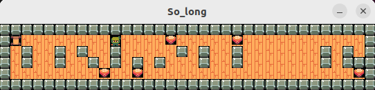

# 🎮 so_long

`so_long` is a small 2D graphical game developed using the **minilibx** graphical library, as part of the 42 School curriculum. The goal of the project is to build a playable game with simple mechanics, tile-based rendering, and keyboard controls.
You play as a character who must collect all items and reach the exit, avoiding traps or invalid paths.

## 🧠 Project Summary
- Built in **C** with the **MiniLibX** graphics library  
- Parses `.ber` map files and validates format and structure  
- Implements 2D tile rendering, keyboard input, and game loop  
- Uses basic algorithms to ensure path solvability  
- Norme-compliant and dynamically handles window events  

<!--<p align="center">
  
</p>
<br>-->

<p align="center">
<a href="https://github.com/IzaroArbaiza/so_long/blob/main/textures/Screencast%20from%2006-30-2025%2001%3A45%3A23%20PM.webm" target="_blank">
  
</a></p>
<br>

## 🗺️ Map Format
A valid map is a `.ber` file containing characters:
```
1 1 1 1 1
1 P 0 C 1
1 0 0 E 1
1 1 1 1 1
```
Legend:
- `1` – Wall  
- `0` – Empty space  
- `P` – Player  
- `C` – Collectible  
- `E` – Exit  

<br>

## 📦🚀 How to Use
Clone the repository and compile:
```bash
git clone https://github.com/IzaroArbaiza/so_long.git
cd so_long && make
```

Run the game
```bash
./so_long maps/mapa.ber
```

### 🕹 Gameplay Mechanics
|KEY|ACTION|
|---|---|
|`W`, ⬆️|Up|
|`A`, ⬅️|Left|
|`S`, ⬇️|Down|
|`D`, ➡️|Right|
|`ESC ❌`|Close window| 
